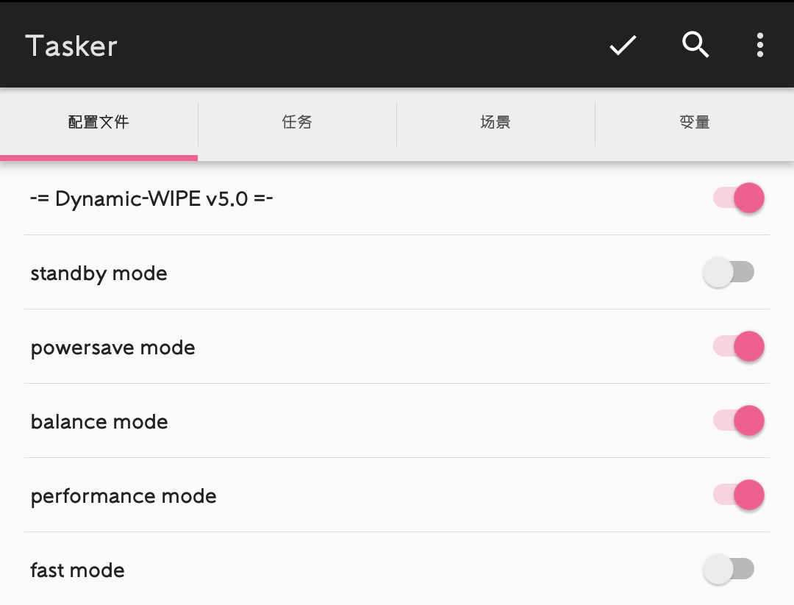

##  Dynamic WIPE

A [Tasker](https://play.google.com/store/apps/details?id=net.dinglisch.android.taskerm) project to use [Project WIPE v2](https://github.com/yc9559/wipe-v2) dynamically. 

利用 `Tasker` 实现自动化运行 `YC` 调度(Project WIPE v2)



###  特性

- [x] **开机自启 → 均衡模式.**
- [x] **打开屏幕 → 若 `3` 分钟(可自定义)之内屏幕不被关闭, 且当前未处于均衡模式, 则启用均衡模式.**
- [x] **关闭屏幕 → 若 `3` 分钟(可自定义)之内屏幕不被打开, 且当前未处于省电模式(可选待机模式), 则启用省电模式(可选待机模式).**
- [x] **运行应用 → 打开应用时立刻启用游戏模式(可选火力全开模式); 应用切换至后台或退出/关闭屏幕(无论是否退出应用)超过 `3` 分钟(可自定义), 则启用均衡/省电模式(可选待机模式).**
- [x] **自动配置 → 自主判断 `SOC` 平台并下载对应 `WIPE v2` 配置文件.**
- [x] **手动设置 → 自行选择设备的 `SOC` 平台并下载对应 `WIPE v2` 配置文件.**
- [ ] 自动更新

> 精简版只内置**省电**和**游戏**两种模式. 开机自启及日常使用默认为**省电模式**, 运行指定应用立刻启用**游戏模式**, 应用切换至后台或退出/关闭屏幕超过 `3` 分钟则返回**省电模式**.

###  原理

利用 `Tasker` 软件创建任务来实现动态运行 `Project WIPE v2`

### 使用教程

- 设备已经取得 `ROOT` 权限.
- 支持 `CPU` 调速器有 `Interactive` 模式的内核.
- 检查 `/data` 目录下是否已有 `powercfg` 配置文件, 若有请先删除.
- 如果原本的温控过于激进, 为了避免影响效果, 需要删除原本的温控.

1. 下载 `Tasker` 主程序.
2. 打开 `Tasker`, 点右上角三个点, 进入**首选项**.
   - 在**界面**一栏取消勾选**初学者模式**(这样在 `Tasker` 主界面就有了**变量**一栏).
   - 在**监视器**一栏, 修改**所有检查秒数**为 `3600`, 勾选**前端运行**(防止时间久了被安卓回收资源).
   - 在**杂项**一栏, 勾选**减少资源消耗**.
3. 下载 `Dynamic_WIPE_xxx.prj.xml` 项目文件(使用 `ADM` 等下载工具将相应链接保存到本地, 有些浏览器打开只会生成预览).
4. 导入项目文件: 打开 `Tasker`, 长按左下角**房子**→ **导入**→找到并选择已下载的 `Dynamic_WIPE_xxx.prj.xml` 项目文件.
5. 进入任务栏, 长按 `- shØut` 点击 `Play` 手动运行一次就 `OK` 啦.

### 下载

 -  [完整版](https://raw.githubusercontent.com/sherlockwoo/dynamic-wipe/master/config/latest/full/Dynamic_WIPE_full_v5.0_20190503.prj.xml "悬停显示")：

    - 内置 **均衡+省电+游戏+极限**
   `https://raw.githubusercontent.com/sherlockwoo/dynamic-wipe/master/config/latest/full/Dynamic_WIPE_full_v5.0_20190503.prj.xml`

-  [精简版](https://raw.githubusercontent.com/sherlockwoo/dynamic-wipe/master/config/latest/lite/Dynamic_WIPE_lite_v2.0_20190503.prj.xml "悬停显示"):

   - 内置 **省电+游戏**
    `https://raw.githubusercontent.com/sherlockwoo/dynamic-wipe/master/config/latest/lite/Dynamic_WIPE_lite_v2.0_20190503.prj.xml`

###  卸载

删除 `Tasker` 配置文件和 `/data/powercfg` 然后重启设备

###  注意

自动配置为实验性功能, 如果完成上述教程步骤后发现软件提示不支持你的设备, 但事实上设备的 `SOC` 确实在 `Project WIPE v2` 支持的 `SOC` 列表里时(详见文末), 可尝试手动下载配置文件.**骁龙 `821` 设备必须手动下载**.

方法: 长按**- 设置** 点击 `Play` , 弹出对话框选择对应设备型号, 再点击下载按钮, 即可下载配置文件并启用预设均衡/省电模式(精简版).


###  FAQ

1. 为什么通知栏总是显示 `Tasker` 无激活配置？

该提示只是说明在当前状态下, 没有配置处于激活状态. **并不影响 `Dynamic WIPE` 的运行**. 因为配置激活是在开机/开启/关闭屏幕的那一瞬间, 如果此时你能看到下拉通知栏就会发现他是激活状态了. 同理, 当运行游戏时, 你会看到`⒊ 游戏模式`被激活.

2. 游戏模式如何添加我想要的应用/游戏呢？

在**配置文件**界面点击`⒊ 游戏模式`以展开, 再点击已有的应用/游戏进入应用列表添加, 同时注意要打开无障碍功能.

3. 软件需要后台吗？

看情况. 如果你需要动态调节特性, 则需要; 如果你全局只需要一种模式, 则不需要.

4. 如何才知道模式启动是否成功了？当前属于什么模式？

内置三种提醒方式: 通知栏提醒、弹出消息提醒、振动提醒; 当前模式可在**变量**栏查看

5. 为什么不用 `Xposed edge pro`？为什么不用微工具箱？为什么不用 `Kernel Auditor`？为什么不用 `Magisk` 模块？

萝卜青菜, 各有所爱; 仁者见仁, 智者见智. 让大家有多种选择.

6. `Project WIPE v2` 内置的 `7` 种性能配置, 具体都有哪些？

```
 0 -> fast 火力全开/低延迟
 1 -> performance 游戏模式/费电
 2 -> level 2 新增
 3 -> balance 均衡使用/均衡
 4 -> level 4 新增
 5 -> powersave 省电流畅/卡顿
 6 -> level 6 待机必备/新增
```
    
7. `Dynamic_WIPE_xxx.prj.xml` 和 `powercfg` 这两个文件有什么区别？

`DynamicWIPE.prj.xml` 是 `Tasker` 的项目文件, `powercfg` 是 `Project WIPE v2` 的配置文件.

8. 运行配置后会报 `powercfg[249]` 的错误？

请检查你的内核是否支持 `Interactive` 模式. 某些内核如 `EAS` 内核的 `CPU` 调速器并没有 `Interactive` 模式, 故执行任务会报错. 通过刷入支持此模式的 `HMP` 内核解决.

9. 我遇到了提示其他错误, 正确的提问方式是什么？

 简述你的操作步骤并提供变量栏中的 `DownloadUrl`、`ConfigStatus`、`WIPEStaus` 和 `Platform` 参数.

10.说了这么多有什么用, 我还是不知道怎样才算成功！能不能简单点！
 


### 更新日志

#### 20190503
1. 同步更新`wipe-v2`
2. 手动下载支持图形化了
3. 新增 **待机必备** 模式
4. 填上了一些之前挖的坑

###  感谢

[@yc9559](https://github.com/yc9559)

###  附：`Project WIPE v2` 支持的 `SOC` 列表 (截至 `2019.05.03`)

> Snapdragon 835, 820, 821@2.0g, 821@2.1g, 821@2.3g, 660, 650/652/653, 636, 625


